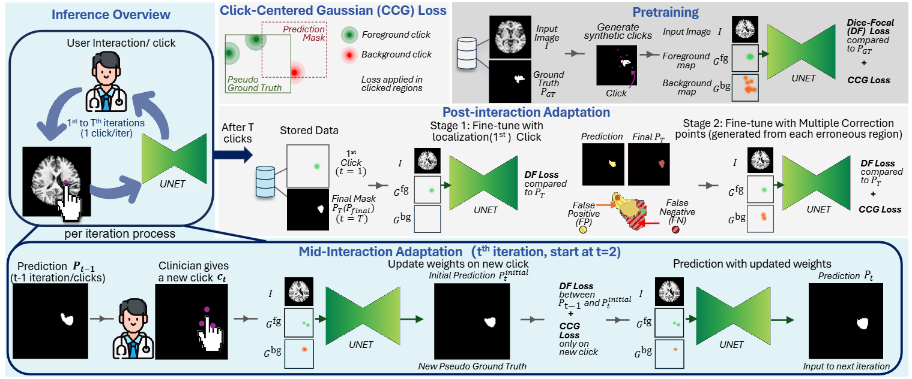

# OAIMS

Official implementation of the paper:

**[You Point, I Learn: Online Adaptation of Interactive Segmentation Models for Handling Distribution Shifts in Medical Imaging](https://arxiv.org/pdf/xxx)**

Accepted at **[ICLR 2026](https://iclr.cc/)**

OAIMS is an online adaptation method for interactive segmentation models. It enables models to learn from user corrections and adapt to new data distributions during the interactive process.

  

## Code

🛠️ Code and **pretrained models** will be released in this repository when available.  
Thank you for your interest and patience! 😊
