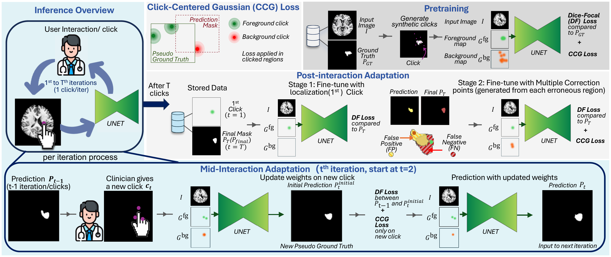

# OAIMS: Online Adaptation of Interactive Medical Segmentation

Official implementation of:

**You Point, I Learn: Online Adaptation of Interactive Segmentation Models for Handling Distribution Shifts in Medical Imaging**

[Paper](https://arxiv.org/abs/2503.06717) | [ICLR 2026](https://iclr.cc/Conferences/2026)

An online adaptation method for interactive segmentation models that learns to adapt to new data distributions during the interactive process.

<p align="center">
  
</p>

## Setup

```bash
conda create -n oaims python=3.10
conda activate oaims
pip install -r requirements.txt
```
You can also install them manually:
**Dependencies:** PyTorch, MONAI, OpenCV, Albumentations, NumPy, SciPy


## Pretrained Models

Three pretrained checkpoints are provided and should be placed in `checkpoints/`. 

| File | Training Data | Download |
|------|--------------|----------|
| `fundus_refuge2.pth` | REFUGE2 | [Download](https://drive.google.com/file/d/15LIbe6rT2te2P5wNtccfOemOu3auvjLJ/view?usp=drive_link) |
| `brain_flair_t1_t1c.pth` | BraTS2023 FLAIR + T1 + T1c | [Download](https://drive.google.com/file/d/1Mf22j1Hk5ZFNAyJm7Gr5oQYHak3636e8/view?usp=drive_link) |
| `brain_flair.pth` | BraTS2023 FLAIR | [Download](https://drive.google.com/file/d/1Pm9R8s0KsPyfPzuvXY5-oBoSeUfgENcl/view?usp=drive_link) |


## Data Format

Images and masks are saved as PNG files in separate `image/` and `mask/` directories. All scripts take image and mask directory paths directly as command-line arguments. Files are loaded in **sorted (alphabetical) order**, so image and mask filenames must match in order after sorting (e.g., use the same filenames for corresponding image and mask pairs). 

The resolutions of the images we used are as follows:

**Fundus (optic disc/cup segmentation):** RGB, 512 x 512 pixels  
**Brain MRI (lesion segmentation):** Grayscale, 256 x 256 pixels

The format of masks is as follows:

**Fundus masks:** Grayscale PNG where pixel value > 128 = background (class 0), = 128 = outer ring (class 1), < 128 = optic cup (class 2).

**Brain masks:** Grayscale PNG where pixel value 0 = background (class 0), 255 = lesion (class 1). 

### Data Preparation for Brain MRI

Brain MRI datasets (e.g., BraTS2023) are provided as 3D volumes. We first merge all foreground classes into a single binary mask (0 = background, 255 = lesion) and remove small connected components with fewer than 10 pixels per slice. For intensity normalization, we first apply percentile clipping (0.5th--99.5th percentile of the non-zero (background) values) and rescale to [0, 255]. From each sample, we select the slice with the largest lesion area (2D), resize both image and mask to 256 x 256, and save them as PNG files.


## How to Run

### Online Adaptation (Test)

Online adaptation adapts a pretrained model to unseen target domains at test time.

#### Fundus 

Run `online_adapt_fundus.py` with the following command line arguments:

- `--gpu` GPU device ID (default: 0)
- `--model_path` Path to pretrained fundus model checkpoint (required)
- `--img_path` Path to folder containing test images (required)
- `--mask_path` Path to folder containing test masks (required)
- `--lr` Learning rate for online adaptation (default: 1e-4)
- `--num_points` Number of interactive clicks per image (default: 10)
- `--disable_mi` Disable Mid-Interaction adaptation, run Post-Interaction only

An example of running online adaptation on a fundus dataset (3-classes):
```bash
python online_adapt_fundus.py --gpu 0 --lr 1e-4 --model_path checkpoints/fundus_refuge2.pth --img_path /path/to/images --mask_path /path/to/masks
```

#### Brain 

Run `online_adapt_brain.py` with the following command line arguments:

- `--gpu` GPU device ID (default: 0)
- `--model_path` Path to pretrained brain model checkpoint (required)
- `--img_path` Path to folder containing test images (required)
- `--mask_path` Path to folder containing test masks (required)
- `--lr` Learning rate for online adaptation (default: 5e-5)
- `--num_points` Number of interactive clicks per image (default: 10)
- `--disable_mi` Disable Mid-Interaction adaptation, run Post-Interaction only

An example of running online adaptation on a brain dataset (2-classes):
```bash
python online_adapt_brain.py --gpu 0 --lr 5e-5 --model_path checkpoints/brain_flair_t1_t1c.pth --img_path /path/to/images --mask_path /path/to/masks
```

### Training

#### Fundus

Run `train_fundus.py` with the following command line arguments:

- `--gpu` GPU device ID (default: 0)
- `--lr` Learning rate (default: 0.0005)
- `--batch_size` Batch size (default: 8)
- `--epochs` Number of training epochs (default: 600)
- `--train_img` Path(s) to training image folder(s). Multiple paths for combining datasets (required)
- `--train_mask` Path(s) to training mask folder(s). Must match `--train_img` order (required)
- `--val_img` Path to validation image folder (required)
- `--val_mask` Path to validation mask folder (required)
- `--num_points` Number of simulated clicks per training step (default: 10)
- `--save_dir` Directory to save checkpoints (default: ./checkpoints)

An example of training on a single fundus dataset:
```bash
python train_fundus.py --lr 0.0005 --batch_size 8 --gpu 0 --epochs 600 --train_img /path/to/train/image --train_mask /path/to/train/mask --val_img /path/to/val/image --val_mask /path/to/val/mask
```


#### Brain 

Run `train_brain.py` with the following command line arguments:

- `--gpu` GPU device ID (default: 0)
- `--lr` Learning rate (default: 0.0005)
- `--batch_size` Batch size (default: 8)
- `--epochs` Number of training epochs (default: 600)
- `--train_img` Path(s) to training image folder(s). Multiple paths for multi-modality training (required)
- `--train_mask` Path(s) to training mask folder(s). Must match `--train_img` order (required)
- `--val_img` Path to validation image folder (required)
- `--val_mask` Path to validation mask folder (required)
- `--num_points` Number of simulated clicks per training step (default: 10)
- `--save_dir` Directory to save checkpoints (default: ./checkpoints)

An example of training on multiple modalities (BraTS FLAIR+T1+T1c), with BraTS T2 as validation:
```bash
python train_brain.py --lr 0.0005 --batch_size 8 --gpu 0 --epochs 600 --train_img /path/to/flair/image /path/to/t1/image /path/to/t1c/image --train_mask /path/to/flair/mask /path/to/t1/mask /path/to/t1c/mask --val_img /path/to/t2/image --val_mask /path/to/t2/mask
```


🚧 **This repository will be extended with more content** 🚧


